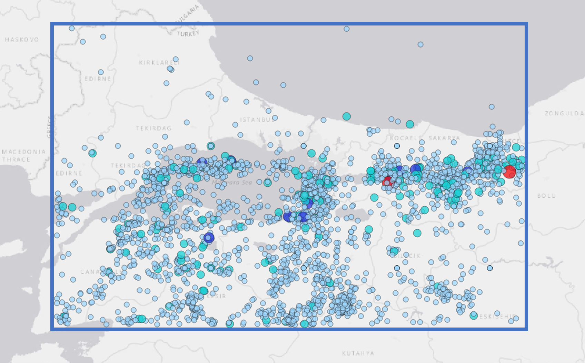
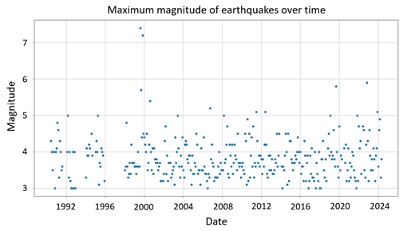
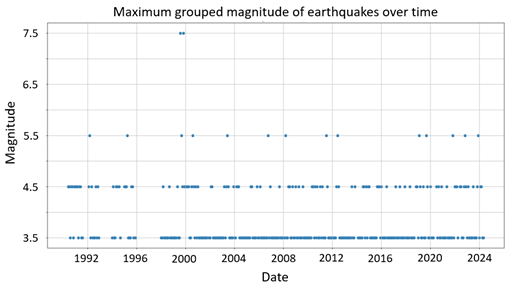
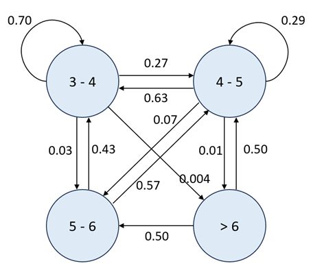

# Earthquake Forecasting Using Discrete-Time Markov Chains (DTMC)

## Introduction

Earthquakes are a major threat, especially in regions with active fault lines like Turkey, which lies in an active seismic zone. The Marmara region in particular is affected by the North Anatolian Fault Zone, which has experienced numerous destructive earthquakes in the past. Understanding the earthquake patterns in this region is crucial for reducing risks.

By using stochastic processes to analyze past earthquakes, we can predict future ones. Predicting future earthquakes helps in planning emergency responses and implementing effective risk management strategies. Ultimately, this increases the safety and resilience of communities in earthquake-prone areas.

The aim of this study is to analyze past earthquakes using the Markov chain stochastic process method in order to estimate the mean recurrence time of future earthquakes.

## Study Area and Data

The Marmara region faces a significant earthquake threat. Numerous studies (Atakan et al. 2002; Erdik et al. 2004; Kalkan et al. 2009; Gülerce and Ocak 2013; Murru et al. 2016) have focused on the anticipated earthquakes in this region. A common conclusion of these studies is the necessity of taking immediate precautions. Therefore, predicting the approximate timing of future earthquakes is of paramount importance.

The Marmara region, located between latitudes 39.52-42.00 and longitudes 26.30-31.40, has been chosen as the study area. Earthquakes that occurred within this region between June 1, 1990 and May 31, 2024 have been collected from the AFAD earthquake catalog website.

  

**Figure 1:** Earthquakes between May 31, 1990 and June 1, 2024 in the Marmara region

Following the methodology of the reference article by Ünal et al. (2023), Markov chain and cluster analysis were conducted using the maximum earthquake magnitudes recorded each month. 

  

**Figure 2:** Maximum magnitude of earthquakes for each month between May 1990 and June 2024

## Method

The Markov Chain method is used to estimate the average transit time of earthquakes in the Marmara region. Markov Chains are mathematical systems that transition from one state to another within a finite set of states based on certain probabilities. These transitions are governed by a probability matrix, where each element represents the probability of transitioning from one state to another. For earthquake prediction, situations can be defined as seismic activities of different magnitudes or locations. By analyzing historical earthquake data, we can estimate these transition probabilities and create a model that predicts the likelihood of future seismic events in the region.

In this study, Discrete-Time Markov Chains (DTMCs) are employed to forecast the progression of earthquake sequences within our study area. A DTMC is a type of Markov chain where the probability distribution of the state at time t+1 is contingent upon the state at time t, with no dependence on prior states. 

## Results

Maximum magnitudes for each month are grouped in this study into intervals such as magnitude between 3 and 4, magnitude between 4 and 5, magnitude between 5 and 6, and greater than 6. The Markov chain process defines these groups as states.

  

**Figure 3:** Maximum grouped magnitude of earthquakes for each month between May 1990 and June 2024

Using a month as the time unit, the sequential transition of earthquakes was taken into consideration to create this one-step transition probability matrix.

**Table 1:** One-month transition probabilities for magnitude group class of earthquake sequence for the region

| States | 3-4      | 4-5      | 5-6      | >6       |
|--------|----------|----------|----------|----------|
| 3-4    | 0.696581 | 0.273504 | 0.025641 | 0.004274 |
| 4-5    | 0.634615 | 0.288462 | 0.067308 | 0.009615 |
| 5-6    | 0.428571 | 0.571429 | 0        | 0        |
| >6     | 0        | 0.5      | 0.5      | 0        |

  

**Figure 4:** One-step transition diagram of magnitude group for the region

This indicates an equilibrium distribution suggesting a process that adheres to an irreducible Markov chain.

π =[0.664, 0.291, 0.039, 0.006]

Since there is an irreducible Markov chain for calculating the recurrence periods of earthquakes in clusters, the earthquake recurrence times of the clusters or mean passage time (in months) are obtained using the equilibrium distribution.

**Table 2:** Mean passage time of the earthquakes sequencing for the Marmara region

| States | 3-4   | 4-5   | 5-6   | >6    |
|--------|-------|-------|-------|-------|
| Mean passage time | 1.51  | 3.44  | 25.37 | 117.46|

## Conclusion

In this study, it is estimated that the mean recurrence time of future earthquakes by analyzing historical earthquakes using the Markov chain stochastic process method. It is predicted that earthquakes in the Marmara Region of Turkey will happen about every 1.5 months with magnitudes ranging from 3 to 4. The estimated recurrence period for earthquakes with a magnitude of 4 to 5 is approximately three and a half months. Furthermore, an earthquake with a magnitude between 5 and 6 is predicted to happen roughly every 25 months, while an earthquake with a magnitude greater than 6 is predicted to happen every 117 months.

## Declaration
This study was conducted as a term project for the CE 505 Applied Stochastic Analysis and Modeling course at Boğaziçi University during the Spring 2023-2024 semester. For access to the full text of the study, please feel free to contact me.

## References

- Atakan K., Ojeda A., Meghraoui M., Barka A., Erdik M., and Bodare A. (2002). "Seismic hazard in Istanbul following the August 17, 1999 Izmit and November 12, 1999 Düzce earthquakes." Bulletin of the Seismological Society of America, 92(1), 466-482.
- Erdik M., Demircioglu M., Sesetyan K., Durukal E., and Siyahi B. (2004). "Earthquake hazard in the Marmara Region, Turkey." Soil Dynamics and Earthquake Engineering, 24(8), 605-631.
- Gulerce Z., and Ocak S. (2013). "Probabilistic seismic hazard assessment of the Eastern Marmara Region." Bulletin of Earthquake Engineering, 11(5), 1259-1277.
- Kalkan E., Gülkan P., Yilmaz N., and Çelebi M. (2009). "Reassessment of probabilistic seismic hazard in the Marmara Region." Bulletin of the Seismological Society of America, 99(4), 2127-2146.
- Murru M., Akinci A., Falcone G., Pucci S., Console R., and Parsons T. (2016). "M7 earthquake rupture forecast and time-dependent probability for the Sea of Marmara region, Turkey." Journal of Geophysical Research: Solid Earth, 121, 2679-2707.
- Ochi M. K. (1990). Applied Probability and Stochastic Processes: In Engineering and Physical Sciences. Wiley.
- Ünal Ceren, Özel Kadilar Gamze, and Eroğlu Azak Tuba. (2023). "A Markov chain approach for earthquake sequencing in the Aegean Graben system of Turkey." Earth Science Informatics, 16, 1-13. 10.1007/s12145-023-00961-5.
